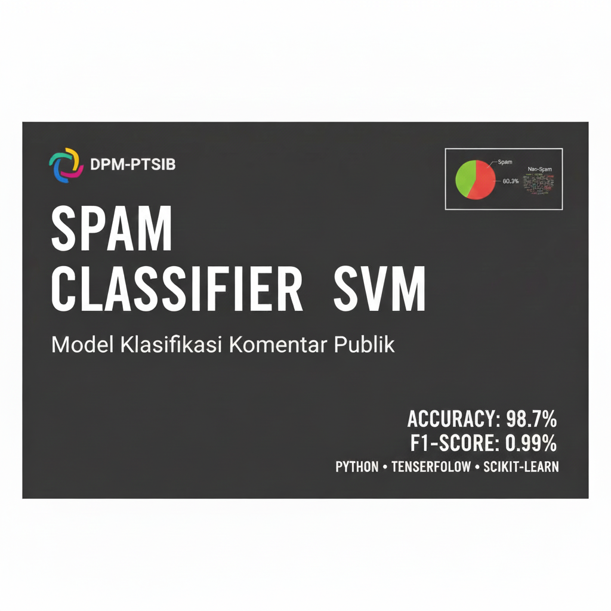
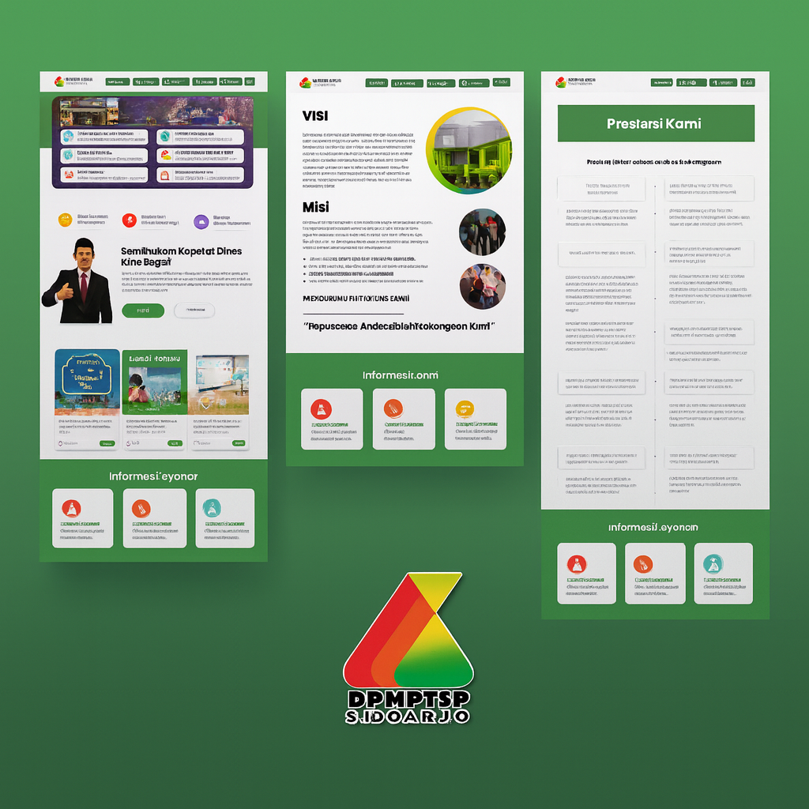

## Laundry APP
Laundry APP adalah aplikasi pemesanan laundry berbasis React Native dengan fitur CRUD yang memudahkan pengguna untuk memesan layanan laundry secara online. Aplikasi ini dilengkapi dengan halaman login, daftar layanan, detail paket, hingga profil pengguna, sehingga menghadirkan pengalaman pemesanan yang praktis dan efisien.
- 
- Tags: Category 1
- Badges:
  - React Native [green]
  - PHP [orange]
  - HTML [blue]
- Buttons:
  - Link [https://github.com/Chucuyeah/Laundry-App]

## Aplikasi Deteksi Spam dan Non Spam Komentar Web DPMPTS
Aplikasi ini menggunakan model klasifikasi berbasis SVM untuk mendeteksi komentar spam dan non-spam pada website DPMPTSP Kabupaten Sidoarjo. Sistem dilengkapi dengan antarmuka React.js dan backend PHP, sehingga mampu menampilkan hasil klasifikasi secara real-time dengan tingkat akurasi 98.7% dan F1-Score 0.99.
- 
- Tags: Category 2
- Badges:
  - React.JS [green]
  - PHP [orange]
  - HTML [blue]
- Buttons:
  - Link [https://github.com/Chucuyeah/spam-app]

## Desain UI/UX Website DPMPTSP Kab.Sidoarjo
Desain UI/UX Figma untuk website DPMPTSP Sidoarjo menampilkan tampilan modern, rapi, dan informatif dengan navigasi yang jelas untuk memudahkan akses layanan dan informasi publik. Penggunaan warna hijau memperkuat identitas instansi serta menciptakan kesan profesional, responsif, dan ramah pengguna.
- 
- Tags: Category 3
- Badges:
  - UI/UX [yellow]