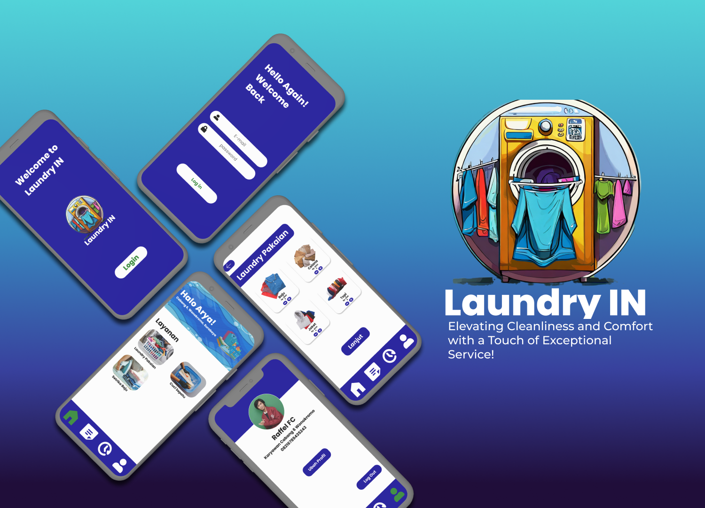
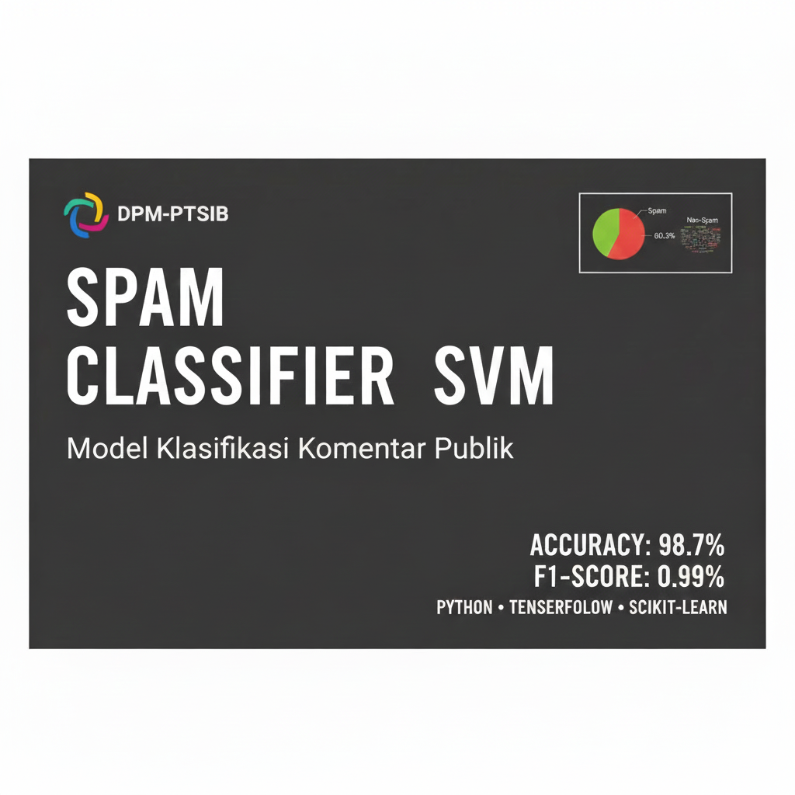
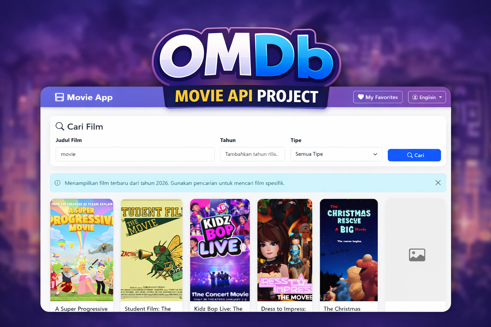

## Laundry APP
Laundry APP adalah aplikasi pemesanan laundry berbasis React Native dengan fitur CRUD yang memudahkan pengguna untuk memesan layanan laundry secara online. Aplikasi ini dilengkapi dengan halaman login, daftar layanan, detail paket, hingga profil pengguna, sehingga menghadirkan pengalaman pemesanan yang praktis dan efisien.
- 
- Tags: Category 2
- Badges:
  - React Native [green]
  - PHP [orange]
  - HTML [red]
- Buttons:
  - Link [https://github.com/Chucuyeah/Laundry-App]

## Aplikasi Deteksi Spam dan Non Spam Komentar Web DPMPTS
Aplikasi ini menggunakan model klasifikasi berbasis SVM untuk mendeteksi komentar spam dan non-spam pada website DPMPTSP Kabupaten Sidoarjo. Sistem dilengkapi dengan antarmuka React.js dan backend PHP, sehingga mampu menampilkan hasil klasifikasi secara real-time dengan tingkat akurasi 98.7% dan F1-Score 0.99.
- 
- Tags: Category 1
- Badges:
  - React.JS [green]
  - PHP [orange]
  - HTML [red]
- Buttons:
  - Link [https://github.com/Chucuyeah/spam-app]

## Movie Search Web App (Integrasi OMDb API)
Aplikasi web pencarian film yang dibangun menggunakan Laravel dengan integrasi OMDb API untuk mengambil data film secara real-time. Aplikasi ini memungkinkan pengguna untuk mencari film berdasarkan judul, memfilter berdasarkan tahun dan tipe film, serta menampilkan poster dan informasi film melalui antarmuka yang sederhana dan responsif.
- 
- Tags: Category 3
- Badges:
  - Larafel [purple]
  - PHP [orange]
  - HTML [red]
  - Boostrap [blue]
- Buttons:
  - Link [https://github.com/Chucuyeah/movie-app-laravel5-API-OMDb]
  - Demo [movie-app-chucuyeah.up.railway.app]
